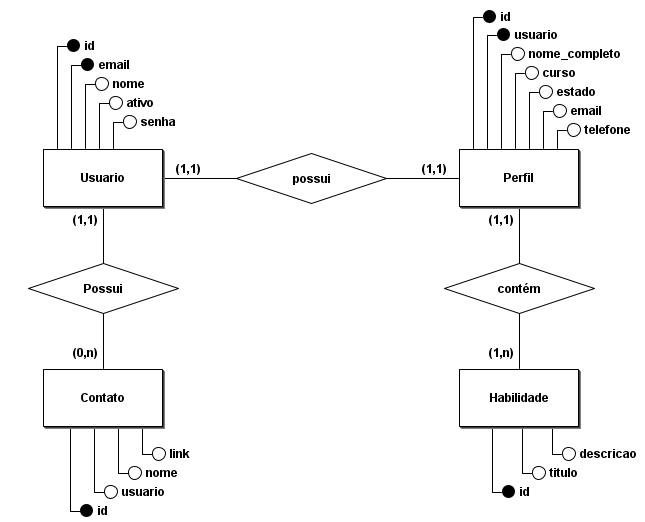
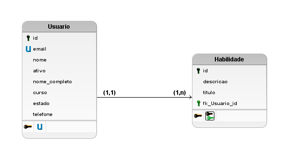

# back-end-tf-web
Back-End do trabalho final da disciplina de WEB

# Backend da Conexão Carreira

A aplicação `Conexão Carreira` foi desenvolvida para promover a conexão entre alunos do IFNMG Campus Salinas e empresas em busca de talentos. Nossa plataforma permite que alunos criem perfis detalhados, destacando experiências acadêmicas, habilidades e informações de contato. Empresas podem explorar perfis e encontrar candidatos qualificados. Facilitamos a integração entre a comunidade acadêmica e o setor empresarial, proporcionando oportunidades valiosas para ambas as partes. Conecte-se, descubra talentos e impulsione o futuro profissional com a `Conexão Carreira`.

## Modelo conceitual do banco de dados



## Modelo lógico do banco de dados



## Modelo físico do banco de dados

[Modelo físico do banco de dados](db/DDL.sql)

## Ferramentas Utilizadas
- **brModelo** (Para cração dos modelos conceitual e lógico)
- **Visual Studio Code** (Para criação do modelo físico)
- **Neon Tech** (Para hospedar o banco de dados)

### Cadastrar Novo Usuário

**Descrição:**
Insere um novo usuário no banco de dados.

**Endpoint:**
```plaintext
back-end-tf-web-gray.vercel.app/api/v1/cadastrar_usuario
```

**Tipo da Requisição:**
```plaintext
POST
```

**Corpo da Requisição:**
```json
{
  "username": "Nome do usuário",
  "password": "***",
  "email": "email-usuario@email.com"
}
```

---

### Listar Todos os Usuários

**Descrição:**
Retorna uma lista de todos os usuários cadastrados no banco de dados.

**Endpoint:**
```plaintext
back-end-tf-web-gray.vercel.app/api/v1/listar_usuarios
```

**Tipo da Requisição:**
```plaintext
GET
```

---

### Detalhes do Usuário

**Descrição:**
Retorna as informações de um usuário específico.

**Endpoint:**
```plaintext
back-end-tf-web-gray.vercel.app/api/v1/detalhes_usuario/<id_do_usuario>
```

**Tipo da Requisição:**
```plaintext
GET
```

---

### Alterar Informações do Usuário

**Descrição:**
Altera as informações de um usuário identificado.

**Endpoint:**
```plaintext
back-end-tf-web-gray.vercel.app/api/v1/alterar_usuario/<id_do_usuario>
```

**Tipo da Requisição:**
```plaintext
PUT
```

**Corpo da Requisição:**
```json
{
  "username": "Novo Nome do Usuário",
  "email": "novo-email@email.com",
  "previous_password": "***",  # Senha anterior
  "password": "nova_senha"
}
```

---

### Excluir Usuário

**Descrição:**
Exclui um usuário identificado.

**Endpoint:**
```plaintext
back-end-tf-web-gray.vercel.app/api/v1/excluir_usuario/<id_do_usuario>
```

**Tipo da Requisição:**
```plaintext
DELETE
```

---

### Cadastrar Novo Perfil

**Descrição:**
Insere um novo perfil no banco de dados.

**Endpoint:**
```plaintext
back-end-tf-web-gray.vercel.app/api/v1/cadastrar_perfil
```

**Tipo da Requisição:**
```plaintext
POST
```

**Corpo da Requisição:**

É importante observar que os campos `status` e `course` recebem numeros inteiros no banco de dados e refletem as opções representadas no modelo do banco de dados:

```python
# Opções para o curso
COURSE_CHOICES = (
    (1, 'Informática'),
    (2, 'Agroindústria'),
    (3, 'Agropecuária')
)

# Opções para status
STATUS_CHOICES = (
    (1, 'Matriculado'),
    (2, 'Cursando'),
    (3, 'Trancado'),
    (4, 'Concluído'),
    (5, 'Desistente'),
    (6, 'Formado')
)
```

Então para um perfil de um aluno de `informática` que está apenas `matriculado`:

```json
{
  "user_id": 1,
  "full_name": "Nome Completo",
  "course": 1,
  "status": 1,
  "email": "email-usuario@email.com",
  "phone": "123456789",
  "skills": "Habilidade 1, Habilidade 2",
  "show_profile": true
}
```

---

### Listar Todos os Perfis

**Descrição:**
Retorna uma lista de todos os perfis cadastrados no banco de dados.

**Endpoint:**
```plaintext
back-end-tf-web-gray.vercel.app/api/v1/listar_perfis
```

**Tipo da Requisição:**
```plaintext
GET
```

---

### Detalhes do Perfil

**Descrição:**
Retorna as informações de um perfil específico.

**Endpoint:**
```plaintext
back-end-tf-web-gray.vercel.app/api/v1/detalhes_perfil/<id_do_perfil>
```

**Tipo da Requisição:**
```plaintext
GET
```

---

### Alterar Informações do Perfil

**Descrição:**
Altera as informações de um perfil identificado.

**Endpoint:**
```plaintext
back-end-tf-web-gray.vercel.app/api/v1/alterar_perfil/<id_do_perfil>
```

**Tipo da Requisição:**
```plaintext
PUT
```

**Corpo da Requisição:**
```json
{
  "full_name": "Novo Nome Completo",
  "course": 2,
  "status": 2,
  "email": "novo-email@email.com",
  "phone": "987654321",
  "skills": "Nova Habilidade 1, Nova Habilidade 2",
  "show_profile": false
}
```

---

### Excluir Perfil

**Descrição:**
Exclui um perfil identificado.

**Endpoint:**
```plaintext
back-end-tf-web-gray.vercel.app/api/v1/excluir_perfil/<id_do_perfil>
```

**Tipo da Requisição:**
```plaintext
DELETE
```
