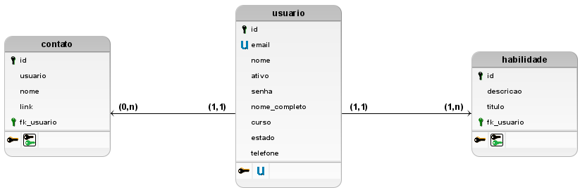

# back-end-tf-web
Back-End do trabalho final da disciplina de WEB

# Backend da Conexão Carreira

A aplicação `Conexão Carreira` foi desenvolvida para promover a conexão entre alunos do IFNMG Campus Salinas e empresas em busca de talentos. Nossa plataforma permite que alunos criem perfis detalhados, destacando experiências acadêmicas, habilidades e informações de contato. Empresas podem explorar perfis e encontrar candidatos qualificados. Facilitamos a integração entre a comunidade acadêmica e o setor empresarial, proporcionando oportunidades valiosas para ambas as partes. Conecte-se, descubra talentos e impulsione o futuro profissional com a `Conexão Carreira`.

## Membros da equipe

- Geovanna Mendes Dutra
- John Lucas Ferreira Rodrigues
- Nicoly Thifanny Santos Neres
- Pedro Henrique Santos e Ferreira
- Robert Hucy Nunes Alves

## Modelo conceitual do banco de dados


## Modelo lógico do banco de dados



## Modelo físico do banco de dados

[Modelo físico do banco de dados](db/DDL.sql)

## Ferramentas Utilizadas
- **brModelo** (Para cração dos modelos conceitual e lógico)
- **Visual Studio Code** (Para criação do modelo físico)
- **Neon Tech** (Para hospedar o banco de dados)
- **Vercel** (Para hospedagem da API)

## Endpoints da API

**URL da API: https://api-conexao-carreira.vercel.app**

---
#### [POST] /login

**Descrição:** Retorna o token de acesso para a API.

**Body:**
```json
{
    "email": "email",
    "senha": "senha"
}
```

**Observações**

Usuário padrão da API:

```json
{
    "email": "admin@admin",
    "senha": "admin123"
}
```

---
#### [GET] /user

**Descrição:** Retorna os dados de todos os usuários cadastrados.

**Header:**
```js
token: your_login_token
```

---
#### [GET] /user/{id}

**Descrição:** Retorna os dados de um usuário em específico.

**Header:**
```js
token: your_login_token
```

---
#### [GET] /user/{id}/hability

**Descrição:** Retorna as habilidades de um usuário.

**Header:**
```js
token: your_login_token
```

---
#### [GET] /user/{id}/contact

**Descrição:** Retorna os contatos de um usuário.

**Header:**
```js
token: your_login_token
```

---
#### [POST] /user

**Descrição:** Insere um novo usuário no sistema.

**Header:**
```js
token: your_login_token
```

**Body:**
```json
{
    "nome": "nome" (String),
    "nome_completo": "nome_completo" (String),
    "email": "email" (String),
    "senha": "senha" (String),
    "telefone": "telefone" (String),
    "curso": "curso" (Int),
    "estado": "estado" (Int),
    "ativo": "ativo" (Bool),
    "profile_image": "profile_image" (String)
}
```

**Observações**

Possíveis valores para o campo curso:

```php
[0] => "Agroindústria"
[1] => "Agropecuária"
[2] => "Informática"
```

Possíveis valores para o campo estado:

```php
[0] => "Matriculado"
[1] => "Cursando"
[2] => "Trancado"
[3] => "Concluído"
[4] => "Desistente"
```

---
#### [POST] /user/login

**Descrição:** Verifica as credenciais de um usuário e retorna seus dados se elas estiverem corretas.

**Header:**
```js
token: your_login_token
```

**Body:**
```json
{
    "email": "email" (String),
    "senha": "senha" (String)
}
```

---
#### [PUT] /user/{id}

**Descrição:** Atualiza os dados de um usuário.

**Header:**
```js
token: your_login_token
```

**Body:**
```json
{
    "nome": "nome" (String),
    "nome_completo": "nome_completo" (String),
    "email": "email" (String),
    "senha": "senha" (String),
    "telefone": "telefone" (String),
    "curso": "curso" (Int),
    "estado": "estado" (Int),
    "ativo": "ativo" (Bool),
    "profile_image": "profile_image" (String)
}
```

**Observações**

Possíveis valores para o campo curso:

```php
[0] => "Agroindústria"
[1] => "Agropecuária"
[2] => "Informática"
```

Possíveis valores para o campo estado:

```php
[0] => "Matriculado"
[1] => "Cursando"
[2] => "Trancado"
[3] => "Concluído"
[4] => "Desistente"
```

---
#### [DELETE] /user/{id}

**Descrição:** Exclui um usuário do sistema.

**Header:**
```js
token: your_login_token
```

---
#### [POST] /hability

**Descrição:** Cadastra uma nova habilidade.

**Header:**
```js
token: your_login_token
```

**Body:**
```json
{
    "usuario": "usuario" (Int),
    "titulo": "titulo" (String),
    "descricao": "descricao" (String)
}
```

---
#### [PUT] /hability/{id}

**Descrição:** Atualiza os dados de uma habilidade.

**Header:**
```js
token: your_login_token
```

**Body:**
```json
{
    "usuario": "usuario" (Int),
    "titulo": "titulo" (String),
    "descricao": "descricao" (String)
}
```

---
#### [DELETE] /hability/{id}

**Descrição:** Exclui uma habilidade.

**Header:**
```js
token: your_login_token
```

---
#### [POST] /contact

**Descrição:** Cadastra um novo contato.

**Header:**
```js
token: your_login_token
```

**Body:**
```json
{
    "usuario": "usuario" (Int),
    "nome": "nome" (String),
    "link": "link" (String)
}
```

---
#### [PUT] /contact/{id}

**Descrição:** Atualiza os dados de um contato.

**Header:**
```js
token: your_login_token
```

**Body:**
```json
{
    "usuario": "usuario" (Int),
    "nome": "nome" (String),
    "link": "link" (String)
}
```

---
#### [DELETE] /contact/{id}

**Descrição:** Exclui um contato.

**Header:**
```js
token: your_login_token
```
